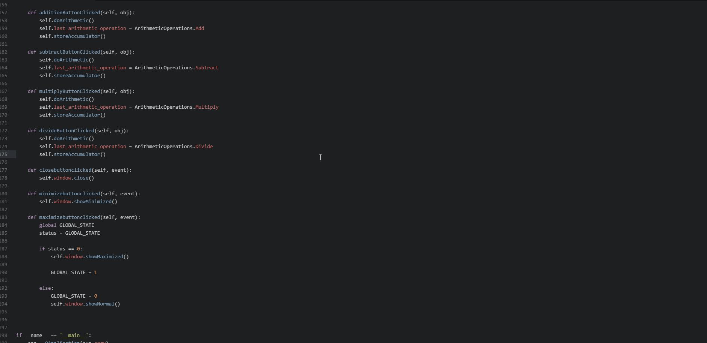

# P03-mc683

```
pip install PySide2
```
# Calculator?
For this project I attempted to have a calculator that would be placed in a window and to create my own close, minimize, and maximize/restore buttons using the Qt Designer.
I was able to do some "fancy" editing by selecting the colors of the window, calculator, and buttons. The behind the scene stuff, the code, for the calculator was relatively straight forward and with the help of the professor that came together without any problems. The parts that were difficult was connecting the buttons for the size of the window to fuction properly. I believe I went through so many trial and erros just getting it to work properly and then after all of that I wasn't able to get the frames to follow correctly. I'm definitely going to continue working on this and make it better.

Demonstration:

